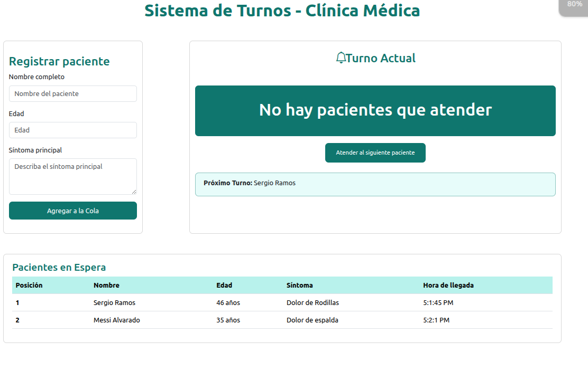

# 🚀 Funcionamiento de una clinica

## 📝 Clinica (hacer cola para recibir atención médica)
Este sorftware nos funciona para poder programar la entrada de personas y atenderlas conforme vayan registrandose.

## 🎯 Objetivos
- ✅ Funcionamiento de una cola (Estructuras de datos)
- ✅ Tener más conocimientos en Javascript y manejo de Dom

## 🛠️ Tecnologías / Herramientas Utilizadas
- 🧪 Lenguajes de programación:
    - JavasCript
    - HTML
    - CSS
    - Framework Bootstrap
## 📅 Cronograma / Fases del Proyecto
| 🔢 Fase            | 🕐 Inicio       | 🛑 Finalización | 🗒️ Descripción breve       |
|-------------------|----------------|----------------|-------------------------------|
| Fase 1            | 12/06/2025      | 12/06/2025      | Desarrollo y Finalización     |

## ---------------- Vista previa del Proyecto --------------------

## 📬 Contacto
**👤 Responsable:** Agustín López

**📧 Correo electrónico:** agus77chang@gmail.com  

**📞 Teléfono:** 54505400 

